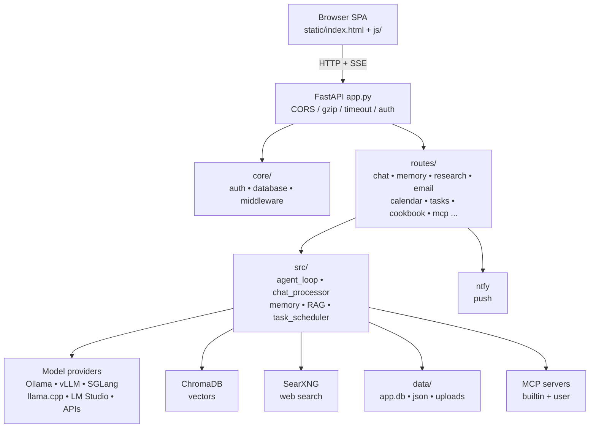
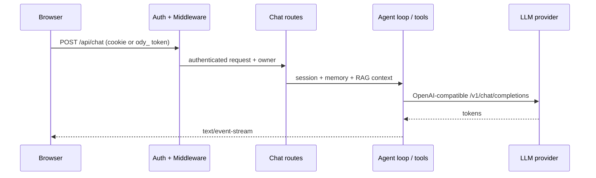
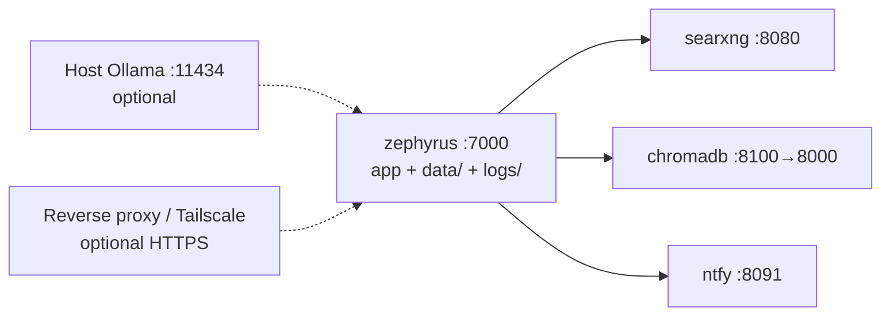

# Zephyrus

Local-first AI workspace: chat with any OpenAI-compatible model, plus memory, personal-document RAG, deep research, email, calendar, tasks, notes, gallery, voice, and local model serving — all self-hosted behind one FastAPI app.

No root README existed before; start here, then go deeper with [`docs/setup.md`](docs/setup.md), [`CONTRIBUTING.md`](CONTRIBUTING.md), [`SECURITY.md`](SECURITY.md), and [`ROADMAP.md`](ROADMAP.md).

> Branch note: `dev` is the default development branch and may be unstable. `main` is the curated stable branch. Open PRs against `dev`. See [CONTRIBUTING](CONTRIBUTING.md#branch-model).

## What it is

Zephyrus is a single FastAPI server (`app.py`) serving a no-build SPA (`static/index.html` + `static/js/`) and a large set of JSON/SSE APIs under `routes/`. Business logic lives in `src/` and `core/`, domain services in `services/`, integrations in `integrations/`, MCP bridges in `mcp_servers/`.

Key properties:

- Local-first: all user data lives in `data/` (SQLite `app.db`, JSON settings, uploads, vectors). See [Data layout](#data-layout).
- Provider-agnostic: Ollama, LM Studio, vLLM, SGLang, llama.cpp, OpenAI-compatible endpoints, plus Anthropic / Gemini / Groq / xAI / OpenRouter / OpenAI / DeepSeek via provider setup.
- Degrades gracefully: ChromaDB, SearXNG, email, ntfy, or provider probes can be down; the UI reports degraded state instead of crashing.
- Auth by default: session cookies + `ody_` API bearer tokens, per-user privileges, admin-gated dangerous tools.

## Features

| Area | What you get | Where |
|---|---|---|
| Chat + Agent | Streaming chat, tool-calling agent loop, background bash jobs, debates/pipelines | `src/agent_loop.py`, `src/agent_tools/`, `routes/chat_routes.py` |
| Memory | Long-term memory (`memory.json`) + vector semantic memory | `src/memory.py`, `src/memory_vector.py`, `routes/memory/` |
| Personal docs / RAG | Add directories/files, ChromaDB + FastEmbed semantic search | `src/rag_manager.py`, `src/personal_docs.py`, `routes/personal_routes.py` |
| Deep research | Multi-step web research with visual reports | `src/deep_research.py`, `src/research_handler.py`, `routes/research/` |
| Web search | Self-hosted SearXNG (+ optional DuckDuckGo) | `docker-compose.yml`, `services/search/`, `routes/search_routes.py` |
| Email | IMAP/SMTP multi-account, threads, compose, pollers | `routes/email_routes.py`, `routes/email_pollers.py` |
| Calendar / Contacts | CalDAV / CardDAV sync, `.ics` import/export | `src/caldav_sync.py`, `routes/calendar_routes.py`, `routes/contacts/` |
| Tasks / Notes | Scheduled tasks, event bus, assistant log, Keep-style notes | `src/task_scheduler.py`, `routes/task_routes.py`, `routes/note_routes.py` |
| Documents | Artifacts/canvas editor, Office/PDF extraction | `routes/document_routes.py`, `src/document_processor.py` |
| Gallery / Media | Image library, generation, transforms, YouTube transcripts | `routes/gallery/`, `services/youtube/` |
| Voice | TTS + STT (local `faster-whisper` or remote) | `services/tts/`, `services/stt/`, `routes/tts_routes.py`, `routes/stt_routes.py` |
| Cookbook | Download/serve local models, hw fit check, dependency installs | `routes/cookbook_routes.py`, `routes/hwfit_routes.py`, `services/hwfit/` |
| Model compare | Side-by-side A/B comparison | `routes/compare_routes.py` |
| MCP | MCP manager, built-in servers, OAuth, browser via Playwright | `src/mcp_manager.py`, `routes/mcp_routes.py` |
| Integrations | Codex + Claude bridges, companion routes, webhooks, API tokens | `routes/codex_routes.py`, `integrations/codex/`, `integrations/claude/`, `companion/` |
| System | Backup/restore, vault, prefs, fonts, emoji proxy, workspace, shell | `routes/backup_routes.py`, `routes/vault_routes.py`, `routes/shell_routes.py` |

Preview clips live in [`docs/`](docs): `chat.webm`, `research.webm`, `email-outlook.md`, `gallery.webm`, `notes.webm`, `compare.webm`, `document.webm`, plus `zephyrus.jpg`.

## Quickstart

Prerequisites: Docker for the recommended path, or Python 3.11+ for native.

### Docker (recommended)

```bash
git clone https://github.com/pewdiepie-archdaemon/zephyrus.git
cd zephyrus
cp .env.example .env
docker compose up -d --build
```

Open `http://localhost:7000` when healthy. First boot creates admin `admin` (or `$ZEPHYRUS_ADMIN_USER`) and prints a temporary password to stdout / `docker compose logs zephyrus`. Change it in Settings.

Useful checks:

```bash
docker compose ps
docker compose logs --tail=120 zephyrus
docker compose logs zephyrus | grep -E 'ChromaDB|MemoryVectorStore|DEGRADED'
```

GPU and extra Compose overlays are documented in [`docs/setup.md`](docs/setup.md) (`docker/gpu.nvidia.yml`, `docker/gpu.amd.yml`, `docker/host-docker.yml`, standalone `docker-compose.gpu-*.yml`).

### Native Linux / macOS

```bash
git clone https://github.com/pewdiepie-archdaemon/zephyrus.git
cd zephyrus
python3 -m venv venv
source venv/bin/activate
pip install -r requirements.txt
python setup.py
python -m uvicorn app:app --host 127.0.0.1 --port 7000
```

Apple Silicon (`start-macos.sh` serves on `7860` because AirPlay often holds `7000`):

```bash
./start-macos.sh
# optional LAN over Tailscale:
ZEPHYRUS_HOST=0.0.0.0 ./start-macos.sh
```

### Native Windows

```powershell
git clone https://github.com/pewdiepie-archdaemon/zephyrus.git
cd zephyrus
powershell -ExecutionPolicy Bypass -File .\launch-windows.ps1
```

Manual equivalent uses `py -3.11 -m venv venv`, `pip install -r requirements.txt`, `python setup.py`, `python -m uvicorn app:app --host 127.0.0.1 --port 7000`. Cookbook background jobs also want Git for Windows (`bash.exe`). Local GPU serving needs Linux/WSL2; on Windows use Ollama at `http://localhost:11434/v1`.

Full install, troubleshooting, Outlook limits, optional deps (`faster-whisper`, `ddgs`, `PyMuPDF`, `markitdown`), and `uv` notes: [`docs/setup.md`](docs/setup.md).

## Configuration

Most setup happens in the UI under Settings. Use `.env` only for deployment-level defaults before first boot. See [`.env.example`](.env.example) and [`docs/setup.md#configuration`](docs/setup.md#configuration).

| Variable | Default | Purpose |
|---|---|---|
| `LLM_HOST` / `LLM_HOSTS` | `localhost` | Model discovery hosts |
| `OLLAMA_BASE_URL` | — | e.g. `http://host.docker.internal:11434/v1` from Docker |
| `SEARXNG_INSTANCE` | `http://localhost:8080` (`http://searxng:8080` in Compose) | Web search |
| `APP_BIND` / `APP_PORT` | `127.0.0.1` / `7000` | Host bind for Compose UI |
| `AUTH_ENABLED` | `true` | Keep on for any network deployment |
| `LOCALHOST_BYPASS` | `false` | Dev-only loopback bypass; keep `false` shared |
| `SECURE_COOKIES` | `false` | Set `true` behind HTTPS proxy/gateway |
| `DATABASE_URL` | `sqlite:///./data/app.db` | App database |
| `CHROMADB_HOST` / `CHROMADB_PORT` | `localhost` / `8100` (`chromadb:8000` in Compose) | Vector store |
| `EMBEDDING_URL` / `EMBEDDING_MODEL` | Ollama default | HTTP embeddings; falls back to FastEmbed ONNX |
| `ZEPHYRUS_DATA_DIR` | `./data` | Move all persisted state elsewhere |
| `ZEPHYRUS_*_MAX_BYTES` | see `.env.example` | Per-feature upload caps |
| `NTFY_BIND` / `NTFY_BASE_URL` | `127.0.0.1` / `http://localhost:8091` | Phone push via self-hosted ntfy |

Ollama on the host from Docker: add `http://host.docker.internal:11434/v1` in Settings and start Ollama with `OLLAMA_HOST=0.0.0.0:11434 ollama serve`.

## Architecture



### Request flow (chat)



### Docker services



Ports above are the documented host defaults; Compose binds them to loopback unless you opt into LAN access. Keep raw service ports internal and expose only the authenticated Zephyrus entrypoint.

## Data layout

All state lives under `data/` (gitignored). Canonical paths are defined in [`src/constants.py`](src/constants.py) — import them instead of hardcoding.

```text
data/
  app.db                 # sessions, messages, documents, tasks
  auth.json              # users (admin seeded on first boot)
  settings.json          # app settings
  memory.json            # long-term memory
  presets.json           # model presets
  uploads/               # chat attachments
  personal_docs/         # RAG source docs
  chroma/                # local vector persistence
  gallery/ gallery_uploads/ generated_images/
  tts_cache/ fastembed_cache/
  skills/                # disk-backed skills
  mail-attachments/
  ssh/                   # Cookbook remote-server key
  huggingface/ local/    # Cookbook cache + serve engines (Docker)
```

Backup/restore: [`docs/backup-restore.md`](docs/backup-restore.md).

## Repo map

```text
app.py               # FastAPI entrypoint, middleware, router wiring, lifespan
core/                # auth, database/models, middleware, constants re-export
src/                 # agent loop, chat, memory, RAG, research, scheduler, tools
routes/              # one module per feature area (chat, email, cookbook, MCP...)
services/            # docs, memory, search, hwfit, shell, stt, tts, youtube
static/              # index.html, login.html, style.css, app.js, js/ modules
integrations/        # codex/, claude/ bridges
mcp_servers/         # MCP server implementations
companion/           # companion app routes
config/searxng/      # SearXNG settings template
docker/              # Compose overlays (gpu.nvidia, gpu.amd, host-docker)
docs/                # setup, backup-restore, security-ci, clips, landing page
tests/               # pytest suite + taxonomy (see tests/README.md)
scripts/             # check-docker-gpu, zephyrus-mail, setup helpers
```

Version: [`src/constants.py`](src/constants.py) (`APP_VERSION`). Runtime requires Python 3.11+; `requirements.txt` is unpinned, `requirements-optional.txt` unlocks STT/search/PDF/Office extras.

## Development

```bash
python -m pytest
python -m py_compile app.py routes/*.py src/*.py
node --check static/js/<file-you-changed>.js
```

Docker changes:

```bash
docker compose config
docker compose up -d --build
docker compose logs --tail=120 zephyrus
```

Conventions that matter for review:

- Paths: use named constants from `src/constants.py` (`AUTH_FILE`, `SETTINGS_FILE`, `TTS_CACHE_DIR`, ...). Never hardcode `/app/...` or relative `data/...`.
- Loopback URLs: use `internal_api_base()` (honors `ZEPHYRUS_INTERNAL_BASE` / `APP_PORT`), not `http://localhost:7000`.
- Commits: Conventional Commits (`fix(search): ...`, `feat(notes): ...`).
- Visual changes: run the app, attach screenshots/clips, reuse CSS variables and existing components, no emoji in UI, `Fira Code` + dark theme by default.
- PRs go to `dev` with test steps and linked issues. Agent-generated bulk PRs without a prior issue may be closed.

Full rules: [CONTRIBUTING](CONTRIBUTING.md).

## Security

Self-host this like an admin console (shell, uploads, model serving, email, API tokens):

- Keep `AUTH_ENABLED=true`, `LOCALHOST_BYPASS=false`, `SECURE_COOKIES=true` behind HTTPS.
- Bind `127.0.0.1` unless LAN/VPN access is intentional; never expose raw ports directly.
- Keep `.env`, `data/`, `logs/`, DBs, uploads, backups, keys out of git.
- Review `data/auth.json` (disable open signup unless wanted), per-user privileges, and per-integration API tokens/webhooks.
- Rotate anything pasted into shared chats/logs/screenshots.

Reporting: [SECURITY.md](SECURITY.md). Threat model: [THREAT_MODEL.md](THREAT_MODEL.md).

## Roadmap and docs

- Help wanted: [ROADMAP.md](ROADMAP.md) (install smoke tests, cookbook reliability, research presets, prompt bloat, email perf, provider audits).
- Setup deep-dive: [docs/setup.md](docs/setup.md)
- Backup/restore: [docs/backup-restore.md](docs/backup-restore.md)
- Tests taxonomy: [tests/README.md](tests/README.md)
- Acknowledgments: [ACKNOWLEDGMENTS.md](ACKNOWLEDGMENTS.md)

## License

[GNU Affero General Public License v3.0](LICENSE). Network use of a modified version requires offering the corresponding source (see LICENSE §13).
